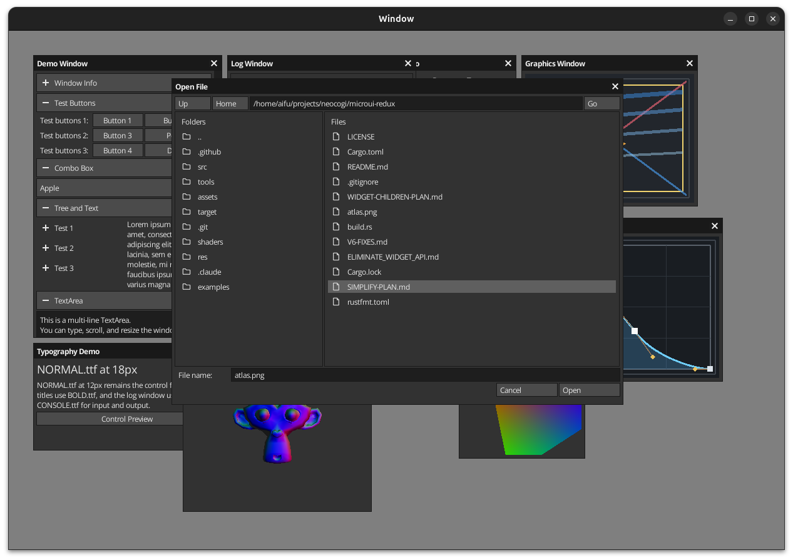

# Rxi's Microui Port to Idiomatic Rust
[](https://crates.io/crates/microui-redux)

This project started as a C2Rust conversion of Rxi's MicroUI and has since grown into a Rust-first UI toolkit. It keeps Microui's compact rendering model while moving UI authoring onto retained `WidgetTree` values, stateful widget structs with pointer-derived identity, and backend-agnostic rendering hooks.

Compared to [microui-rs](https://github.com/neocogi/microui-rs), this crate embraces std types, reusable retained trees, and richer widgets such as custom rendering callbacks, dialogs, and a file dialog.

## Demo
Clone and build the demo (enable exactly one backend feature):
```
$ cargo run --example demo-full --features example-vulkan   # Vulkan backend
# or
$ cargo run --example demo-full --features example-glow     # Glow backend
# or
$ cargo run --example demo-full --features example-wgpu     # WGPU backend
```

`example-backend` is only a shared gate for example code paths; it is **not** runnable by itself.
Running with only `--features example-backend` will fail intentionally at compile time.

`demo-full` now loads `examples/FACEPALM.png` and `assets/suzane.obj` from disk at runtime (no `include_bytes!` for those files).

For a smaller release executable, use nightly + rebuilt `std`:
```bash
RUSTFLAGS="-C strip=symbols -C link-arg=-s -Zlocation-detail=none -Zfmt-debug=none" \
cargo +nightly build \
  --release \
  -Z build-std=std,panic_abort \
  -Z build-std-features=optimize_for_size \
  --example demo-full \
  --no-default-features \
  --features "example-wgpu builder"
```
Replace `example-wgpu` with `example-glow` or `example-vulkan` if needed.



## Key Concepts
- **Context**: owns the renderer handle, user input, frame results, and root windows. Each frame starts by feeding input into the context, then calling `context.window(...)`, `context.dialog(...)`, or `context.popup(...)` with retained trees for every visible surface.
- **Container**: the internal execution object behind windows, panels, popups, and retained tree nodes. Application code should normally work through `Context`, `WindowHandle`, `ContainerHandle`, and `WidgetTreeBuilder` instead of authoring widgets directly on a container.
- **Layout engine + flows**: the engine tracks scope stack, scroll-adjusted coordinates, and content extents, while flows control placement behavior. `WidgetTreeBuilder` exposes retained row/grid/column/stack structure, and widget layout uses each widget's `measure` result so `SizePolicy::Auto` can follow per-widget intrinsic sizing.
- **Widget**: stateful UI element implementing the `Widget` trait (for example `Button`, `Textbox`, `Slider`). These structs hold interaction state and use pointer-derived IDs from their current address.
- **WidgetTree**: retained widget/layout hierarchy built once with `WidgetTreeBuilder` and replayed each frame through `Context::window(...)`, `Context::dialog(...)`, or `Context::popup(...)`. Tree nodes cover widgets, panels, headers/tree nodes, row/grid/column/stack layout groups, and custom rendering, so UI structure stays representable as retained data instead of traversal-time callbacks.
- **Graphics**: widget-local primitive drawing exposed through `WidgetCtx::graphics(...)` and the `Graphics` builder. It covers rectangles, frames, text/icons/images, thick line strokes, filled polygons, and nested local clip scopes.
- **Typography**: atlases can now bake multiple named fonts and sizes. `Style` resolves semantic roles (`body`, `small`, `title`, `heading`, `mono`) through `FontRole`, while individual text-bearing widgets can override their own `font: FontChoice`.
- **Renderer**: any backend that implements the `Renderer` trait can be used. The included SDL2 + glow example demonstrates how to batch the commands produced by a container and upload them to the GPU.

```rust
let name = widget_handle(Textbox::new(""));
let tree = WidgetTreeBuilder::build({
    let name = name.clone();
    move |tree| {
        tree.row(&[SizePolicy::Fixed(120), SizePolicy::Remainder(0)], SizePolicy::Auto, |tree| {
            tree.text("Name");
            tree.widget(name.clone());
        });
    }
});

ctx.window(&mut main_window, ContainerOption::NONE, WidgetBehaviourOption::NONE, &tree);

if ctx.committed_results().state_of_handle(&name).is_submitted() {
    // react to the textbox submission here
}
```

Retained trees are the supported public authoring path. Post-render business logic lives alongside the window call and reads from `ctx.committed_results()`, which intentionally exposes the previous frame's published interaction generation:

```rust
ctx.window(&mut main_window, ContainerOption::NONE, WidgetBehaviourOption::NONE, &tree);

let results = ctx.committed_results();
if results.state_of_handle(&submit_button).is_submitted() {
    save_form();
}
```

### Widget IDs
Widget IDs default to the address of the widget state. This is stable as long as the state stays at a fixed address, but it can change if the state lives inside a `Vec` that grows/shrinks (reallocation moves items). If that happens, focus/hover continuity follows the new addresses.

When setting focus manually, pass a widget pointer ID from `widget_id_of` or `widget_id_of_handle`:

```rust
my_window.set_focus(Some(widget_id_of_handle(&my_textbox_handle)));
```

Window, dialog, and popup builders now accept a `WidgetBehaviourOption` to control scroll behavior. Use `WidgetBehaviourOption::NO_SCROLL`
for popups that should not scroll, `WidgetBehaviourOption::GRAB_SCROLL` for widgets that want to consume scroll, and
`WidgetBehaviourOption::NONE` for default behavior. Custom widgets receive consumed scroll in `CustomRenderArgs::scroll_delta`.

### Preferred sizing and retained layout
- Every built-in widget reports its own intrinsic preferred size from content metrics (text/icon/thumb/line layout).
- Retained traversal measures committed widget state, allocates the widget rectangle, then calls `Widget::run` to sample interaction and update widget-local state.
- `WidgetTreeBuilder` exposes retained `row`, `grid`, `column`, `stack`, `header`, `tree_node`, `container`, and `custom_render` structure so layout stays declarative instead of closure-driven.
- `SizePolicy::Weight(value)` distributes available track space by sibling weight ratio (spacing accounted for). In single-track flows, it uses a `0..=100` scale.
- Returning `<= 0` for either axis from `Widget::measure` still means "use layout fallback/defaults" for that axis.

## Images and textures
Some widgets can render an `Image`, which can reference either a slot **or** an uploaded texture at runtime:

```rust
let texture = ctx.load_image_from(ImageSource::Png { bytes: include_bytes!("assets/IMAGE.png") })?;
let image_button = widget_handle(Button::with_image(
    "External Image",
    Some(Image::Texture(texture)),
    WidgetOption::NONE,
    WidgetFillOption::ALL,
));
let tree = WidgetTreeBuilder::build({
    let image_button = image_button.clone();
    move |tree| tree.widget(image_button.clone())
});

ctx.window(&mut image_window, ContainerOption::NONE, WidgetBehaviourOption::NONE, &tree);
if ctx.committed_results().state_of_handle(&image_button).is_submitted() {
    // react here
}
```

- `Image::Slot` renders an entry from the atlas and benefits from batching.
- `Image::Texture` targets renderer-owned textures (the backend handles binding when drawing).
- `WidgetFillOption` controls which interaction states draw a filled background; use `WidgetFillOption::ALL` to keep the default normal/hover/click fills.
- Use `Context::load_image_rgba`/`load_image_from` and `Context::free_image` to manage the lifetime of external textures.

## Graphics primitives
- `WidgetCtx::graphics(...)` exposes a widget-local `Graphics` builder for custom widgets and paint code.
- The builder provides `draw_rect`, `draw_box`, `draw_text`, `draw_icon`, `draw_image`, `draw_frame`, `draw_widget_frame`, `draw_control_text`, `stroke_line`, `fill_polygon`, and local clip helpers such as `with_clip`.
- Filled shapes and strokes are tessellated into retained triangles and clipped in software before replay, so primitive rendering stays consistent across glow, Vulkan, and WGPU backends.
- `examples/demo-full` includes a dedicated graphics window that exercises the primitive API.

## Fonts and typography
- Atlas building supports multiple baked fonts and sizes through `builder::FontAsset`, and the same config can drive both runtime atlas construction and offline/prebuilt atlas export.
- `Context::new(...)` binds the conventional atlas keys `body`, `small`, `title`, `heading`, and `mono` onto the default `Style`. `Context::set_style(...)` also rebinds any font fields that are still left at their default/unset values, so tweaking colors or spacing on top of `Style::default()` keeps the intended body/title sizes.
- Text-bearing widgets expose `font: FontChoice`, so you can either select a semantic role (`FontRole::Heading.into()`) or a concrete baked font ID (`atlas.font_id("caption").unwrap().into()`).
- Font sizes are selected by choosing another baked font variant, not by scaling one bitmap font at runtime.
- `examples/demo-full` uses this directly: `NORMAL.ttf` for control/body text, `BOLD.ttf` for window titles, and `CONSOLE.ttf` for the log window’s input/output text.

```rust
use microui_redux::{builder, FontRole, TextBlock};

const FONTS: &[builder::FontAsset<'static>] = &[
    builder::FontAsset {
        name: "body",
        path: "assets/NORMAL.ttf",
        size: 12,
    },
    builder::FontAsset {
        name: "small",
        path: "assets/NORMAL.ttf",
        size: 10,
    },
    builder::FontAsset {
        name: "title",
        path: "assets/BOLD.ttf",
        size: 16,
    },
    builder::FontAsset {
        name: "heading",
        path: "assets/NORMAL.ttf",
        size: 18,
    },
    builder::FontAsset {
        name: "mono",
        path: "assets/CONSOLE.ttf",
        size: 12,
    },
];

let config = builder::Config {
    texture_width: 512,
    texture_height: 256,
    white_icon: "assets/WHITE.png".into(),
    close_icon: "assets/CLOSE.png".into(),
    expand_icon: "assets/PLUS.png".into(),
    collapse_icon: "assets/MINUS.png".into(),
    check_icon: "assets/CHECK.png".into(),
    expand_down_icon: "assets/EXPAND_DOWN.png".into(),
    open_folder_16_icon: "assets/OPEN_FOLDER_16.png".into(),
    closed_folder_16_icon: "assets/CLOSED_FOLDER_16.png".into(),
    file_16_icon: "assets/FILE_16.png".into(),
    default_font: "assets/NORMAL.ttf".into(),
    default_font_size: 12,
    fonts: FONTS,
    slots: &[],
};

let mut title = TextBlock::new("Inspector");
title.font = FontRole::Heading.into();
```

If `fonts` is empty, `builder::Config` falls back to `default_font` + `default_font_size` for the old single-font atlas layout.

## Cargo features
- `builder` *(default)* – enables the runtime atlas builder and PNG decoding helpers used by the examples.
- `png_source` – allows serialized atlases and `ImageSource::Png { .. }` uploads to stay compressed.
- `save-to-rust` – enables `AtlasHandle::to_rust_files` to emit the current atlas as Rust code for embedding.
- `prebuilt-atlas` – opt-in example atlas embedding; without it, examples build their atlas at runtime.
- `example-backend` – shared internal gate used by examples; pair it with exactly one concrete backend.
- `example-glow` / `example-vulkan` / `example-wgpu` – concrete example backends; choose exactly one when running examples.

Disabling default features leaves only the raw RGBA upload path (`ImageSource::Raw { .. }`):
`cargo build --no-default-features`

The demos build their atlas at runtime unless you opt into `prebuilt-atlas`, so `--no-default-features` example builds should include `builder`:
`cargo run --example demo-full --no-default-features --features "example-vulkan builder"`

Equivalent command using the shared gate explicitly:
`cargo run --example demo-full --no-default-features --features "example-backend example-vulkan builder"`

To embed the generated atlas instead, add `prebuilt-atlas` explicitly:
`cargo run --example demo-full --no-default-features --features "example-vulkan prebuilt-atlas"`

To export an atlas as Rust, enable `save-to-rust` (optionally `png_source` for PNG bytes) and call `AtlasHandle::to_rust_files`, or use the helper binary:
`cargo run --bin atlas_export --features "builder save-to-rust" -- --output path/to/atlas.rs`

## Text rendering and layout
- Retained text widgets automatically center the font’s **baseline** inside each cell, and every line gets a small vertical pad so glyphs never touch the widget borders.
- `TextBlock` supports wrapped multi-line content while preserving outer padding without adding extra spacing between lines.
- Custom rendering still goes through retained `custom_render` nodes, which receive layout, input, and clip information through `CustomRenderArgs`.

### Version 0.6
Version `0.6.0` is the retained-tree release. Compared to `0.5.0`, it replaces the public immediate/closure authoring path with retained widget trees and committed interaction results.

- [x] Replaced the v0.5 public immediate/closure authoring path with retained widget trees.
    - [x] `Context::window`, `dialog`, and `popup` now take `&WidgetTree` instead of UI-building closures.
    - [x] `WidgetTree` nodes cover widgets, embedded containers, headers/tree nodes, row/grid/column/stack groups, and custom render leaves.
    - [x] The public immediate widget-helper surface and `tree.run(...)` escape hatch are gone from the supported API.
- [x] Added a retained composition API with stable node identity and a smaller builder surface.
    - [x] `WidgetTree` / `WidgetTreeBuilder` provide reusable retained widget/layout hierarchies with stable `NodeId`s.
    - [x] `WidgetTreeBuilder` is centered on one `NodeOptions` value that carries optional keys and optional placement metadata.
    - [x] The old `keyed_*` / `*_with_policy` builder matrix was collapsed into one default insertion method plus one `*_with(NodeOptions, ...)` overload per structural concept.
- [x] Reworked retained execution around explicit layout and interaction generations.
    - [x] Retained traversal now runs a layout pass and a `Widget::run` pass, reusing cached geometry instead of advancing layout while rendering.
    - [x] `WidgetTreeCache` stores layout and interaction separately across previous/current generations.
    - [x] The temporary runtime adapter tree was removed; retained traversal now walks `WidgetTreeNode` values directly.
- [x] Tightened the widget/runtime contract compared to v0.5.
    - [x] Widgets now implement `measure` + `run`; the intermediate `reconcile` / frame-commit design was removed.
    - [x] Persistent widget state stays inside the widget handle and mutates during `run`.
    - [x] Pointer-derived widget IDs remain the source of focus, hover, and result lookup, with `widget_id_of` and `widget_id_of_handle` as the public helpers.
- [x] Added widget-local graphics primitives as a first-class paint path.
    - [x] `WidgetCtx::graphics(...)` and `Graphics` expose rectangles, frames, text/icons/images, thick line strokes, polygon fills, and nested local clip scopes.
    - [x] Primitives are tessellated into retained triangles and software-clipped before replay, keeping backend behavior consistent without fragmenting batches on clip changes.
- [x] Added multi-font atlas support with semantic typography roles.
    - [x] Runtime atlas building and offline/prebuilt atlas export now share the same multi-font config surface.
    - [x] `Style` binds semantic roles (`body`, `small`, `title`, `heading`, `mono`) from atlas font names, and text-bearing widgets can override their font per instance through `FontChoice`.
    - [x] Different text sizes are represented as separate baked font variants instead of runtime bitmap scaling.
- [x] Made committed retained results the strict public business-logic contract.
    - [x] Per-frame widget results are recorded internally by widget ID and published as the previous frame's committed generation.
    - [x] `Context::committed_results()` is the public app-facing results API, including `FrameResultGeneration::state_of_handle`.
    - [x] Current-frame results stay internal; `FrameResults` and `current_results()` are no longer part of the public surface.
- [x] Migrated shipped UI and supporting widgets to the retained-only model.
    - [x] `examples/simple`, `examples/calculator`, `examples/demo-full`, and `FileDialogState` now build retained trees and react through committed results.
    - [x] Retained display widgets such as `TextBlock` replaced callback-only display glue.
    - [x] Demo/file-dialog lists now reuse persistent `ListItem` state instead of rebuilding transient labels every frame.
- [x] Hardened retained interaction, layout, and renderer integration.
    - [x] Mouse input delivered to widgets and custom render callbacks is localized to the widget rectangle.
    - [x] Root windows and nested panels now share the retained scrollbar/clip/resize ordering needed for correct scrolling and bottom-right resize behavior.
    - [x] Weight-based sizing, directional stacks, wrapped text blocks, retained custom rendering, and the glow/vulkan/wgpu example backends were all kept aligned with the retained execution path.

### Version 0.5
- [x] Widget identity moved fully to pointer-based IDs.
    - [x] Removed `with_id`; focus/hover now use widget trait-object/state pointers.
- [x] Layout refactor: introduced `LayoutEngine` + specialized flows (`RowFlow`, `StackFlow`) instead of a one-size-fits-all manager.
    - [x] Preferred sizing pipeline: widget helpers now call `Widget::measure`, allocate rectangles, then run widgets directly against the current frame input.
    - [x] Directional stack support: `StackDirection::{TopToBottom, BottomToTop}` plus `stack_direction` and `stack_with_width_direction`.
- [x] Context/container API cleanup: `Context` module split, input forwarding helpers, container state encapsulation, and handle views.
- [x] Widget internals cleanup: helper macroization/simplification, node/widget scaffolding unification, and text widget module split.
- [x] Text and input fixes: shared text layout/edit paths, textbox delete/end fixes, centralized widget input fallback.
- [x] Scrollbar behavior cleanup: unified sizing, layout, and drag handling.
- [x] File dialog and atlas fixes, including file dialog layout redesign and footer/button spacing corrections.
- [x] Added WGPU example backend and migrated demo-full to new layout flow APIs.
- [x] Added directional stack demo window and expanded documentation/comments for layout and WGPU renderer.

### Version 0.4
- [x] Stateful widgets
    - [x] Stateful widgets for core controls (button, list item, checkbox, textbox, slider, number, custom).
    - [x] Pointer-based widget IDs; InputSnapshot threaded through widgets and cached per frame.
    - [x] IdManager removed; widget IDs now derive from state pointers.
    - [x] Widget API redesign requires stateful widget instances; trait/type renames applied.
    - [x] Legacy `button_ex*` shims removed.
    - [x] DrawCtx extracted into its own module and shared via WidgetCtx.
    - [x] WidgetState/WidgetCtx pipeline with ControlState returned from `update_control`.
- [x] File dialog UX fixes (close on OK/cancel, path-aware browsing).
- [x] Expanded unit tests for scrollbars, sliders, and PNG decoding paths.
- [x] Style shared via `Rc<Style>` across containers/panels; window chrome state moved into `Window`.
- [x] `Container::style` now uses `Rc<Style>`.

### Version 0.3
- [x] Use `std` (`Vec`, `parse`, ...)
- [x] Containers contain clip stack and command list
- [x] Move `begin_*`, `end_*` functions to closures
- [x] Move to AtlasRenderer Trait
- [x] Remove/Refactor `Pool`
- [x] Change layout code
- [x] Treenode as tree
- [x] Manage windows lifetime & ownership outside of context (use root windows)
- [x] Manage containers lifetime & ownership outside of contaienrs
- [x] Software based textured rectangle clipping
- [x] Add Atlasser to the code
    - [x] Runtime atlasser
        - [x] Icon
        - [x] Font (Hash Table)
    - [x] Separate Atlas Builder from the Atlas
    - [x] Builder feature
    - [x] Save Atlas to rust
    - [x] Atlas loader from const rust
- [x] Image widget
- [x] Png Atlas source
- [x] Pass-Through rendering command (for 3D viewports)
- [x] Custom Rendering widget
    - [x] Mouse input event
    - [x] Keyboard event
    - [x] Text event
    - [x] Drag outside of the region
    - [x] Rendering
- [x] Dialog support
- [x] File dialog
- [x] API/Examples loop/iterations
    - [x] Simple example
    - [x] Full api use example (3d/dialog/..)
- [x] Documentation
