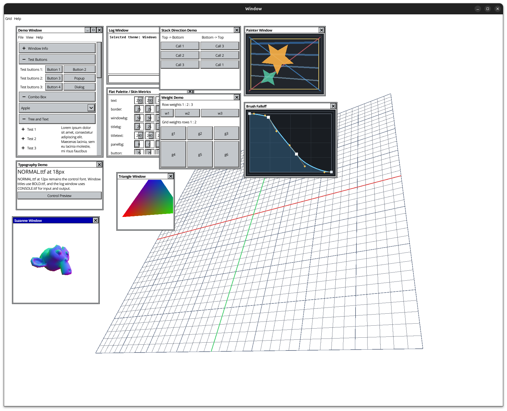
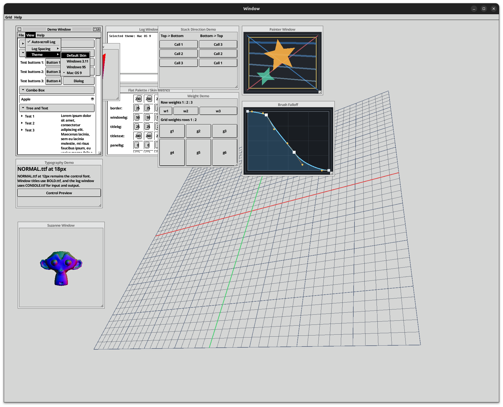

# microui-redux

[](https://crates.io/crates/microui-redux)

`microui-redux` is a retained, backend-agnostic Rust GUI toolkit inspired by
[rxi/microui](https://github.com/rxi/microui). Applications assemble uniquely owned `Node` trees,
retain typed weak handles for later access, and register windows, dialogs, popups, and menus in a
`Context`. Ordered input and typed widget events update that retained state; painting records a
backend-neutral display list for the application's `RendererBackend`.

> **Development status:** `0.8.0` is the current crate version. The crate remains pre-1.0,
> so APIs may continue to evolve in later minor releases.

Compared with [microui-rs](https://github.com/neocogi/microui-rs), this crate embraces standard
library types, reusable retained trees, and richer widgets such as custom rendering callbacks,
dialogs, and a file dialog.

| Windows 3.11 | Mac OS 9 |
| :--: | :--: |
|  |  |

## Getting started

Use the current pre-1.0 release:

```toml
[dependencies]
microui-redux = "0.8.0"
```

`microui-redux` does not create a native window or graphics device. Applications provide a
`RendererBackend`; the repository examples contain SDL-based Glow, Vulkan, and WGPU integrations.

Clone the repository and run the full demo with one backend:

```bash
cargo run --example demo-full --features example-glow
```

See [Examples](docs/EXAMPLES.md) for the other backends, asset requirements, and size-focused
builds.

## Minimal retained UI

Most application code starts with `microui_redux::prelude`. Construct each widget once, move its
unique node into a container, then register the completed tree in the context:

```rust
# use microui_redux::prelude::*;
fn install<B: RendererBackend>(context: &mut Context<B>) -> WindowHandle {
    let (_, hello) = Button::create(ButtonParameters::new("Hello, world!"));
    let (_, content) = Linear::create(LinearParameters::vertical([
        LinearItem::content(hello),
    ]));

    context
        .ui()
        .create_window(Window::new("Hello", rect(40, 40, 300, 120), content))
}
```

Forward platform input to `Context`, synchronize the retained UI once, then render the committed
state through the backend frame:

```rust
# use microui_redux::prelude::*;
# use microui_redux::render::RenderError;
fn draw<B: RendererBackend>(
    context: &mut Context<B>,
    dimensions: Dimensioni,
    frame_info: FrameInfo,
) -> Result<(), RenderError> {
    context.update_ui(dimensions);
    context.frame(frame_info).render_ui()
}
```

Contexts with application state use `update_ui_state` instead. Call the same update method after
every programmatic widget mutation before depending on its result. The complete
[`simple` example](examples/simple.rs) supplies SDL windowing, input translation, atlas setup, and a
selectable example renderer.

## Documentation

The [documentation index](docs/README.md) routes each topic to one canonical guide. Useful starting
points are [built-in widgets](docs/WIDGETS.md), [typed events](docs/EVENTS.md),
[layout and synchronization](docs/LAYOUT.md), [rendering](docs/RENDER.md), and the
[example catalog](docs/EXAMPLES.md). Release and adoption details live in the
[changelog](docs/CHANGELOG.md) and [support policy](docs/SUPPORT.md).

Applications normally import `microui_redux::prelude`; `microui_redux::retained` is available for
explicit imports of the retained core. Backend contracts live under `microui_redux::render`, atlas
construction lives under `microui_redux::atlas::builder`, and the complete generated API reference
is available on [docs.rs](https://docs.rs/microui-redux).

## License

Project-authored code and assets are licensed under the [BSD 3-Clause License](LICENSE). Portions
derived from rxi/microui retain its MIT terms, and bundled fonts, icons, and demo assets retain the
terms recorded in [asset attribution and licenses](docs/ASSETS.md).
