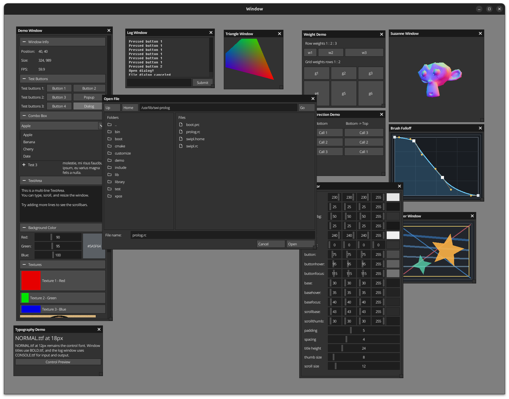

# microui-redux

[](https://crates.io/crates/microui-redux)

`microui-redux` is a retained, backend-agnostic Rust GUI toolkit inspired by
[rxi/microui](https://github.com/rxi/microui). It keeps microui's compact rendering model while
using unique owning `Node` trees, typed weak widget handles, and typed backend frames. A concrete
context-owned surface forest stores every widget tree and menu surface exactly once. Sole parent
edges encode structural child-window, dialog, and popup ownership, chronological window order is
carried by the forest itself, and one deepest-popup key derives the visible transient branch.
Declarative menus are consumed directly into concrete `MenuSurface` values rather than a generic
popup payload, a temporary menu tree, or a separate controller. Logical `KeyEvent` transitions,
persistent retained focus, wrapping Tab traversal, Ctrl+F6 window cycling, shared control actions,
and F10/Alt menu navigation provide one Windows-style keyboard contract across windows, widgets,
and examples.
Explicit `SkinEffects::focus_outline` and `SkinEffects::window_activation` accents make its sole
active widget and window scope visible without exposing remembered focus in inactive windows.

> **Alpha status:** `0.8.0-alpha.6` is the current alpha of the breaking retained-API
> redesign. The 0.8 line is not API-compatible with 0.7 and may continue to evolve before the
> stable 0.8.0 release.

Compared with [microui-rs](https://github.com/neocogi/microui-rs), this crate embraces standard
library types, reusable retained trees, and richer widgets such as custom rendering callbacks,
dialogs, and a file dialog.



## Getting started

Use the explicit alpha version while the retained API is being evaluated:

```toml
[dependencies]
microui-redux = "0.8.0-alpha.6"
```

`microui-redux` does not create a native window or graphics device. Applications provide a
`RendererBackend`; the repository examples contain SDL-based Glow, Vulkan, and WGPU integrations.

Clone the repository and run the full demo with one backend:

```bash
cargo run --example demo-full --features example-glow
```

See [Examples](docs/EXAMPLES.md) for the other backends, asset requirements, and size-focused
builds.

## Retained surface API

Applications borrow a short-lived `Ui<'_>` from `Context` to create or mutate surfaces. Window and
dialog operations take a complete `WindowHandle`; popup operations take a distinct `PopupHandle`.
Each non-owning handle contains private process-unique identity and separately projects its weak
typed event endpoint. Surface lookup never uses an event-port pointer, so freeing and reusing an
allocation cannot retarget a stale handle. There is no public numeric window ID, and a stale or
foreign handle passed to a borrowed operation returns a concrete `SurfaceMutationError`. Fallible
child-window, dialog, and popup creation returns `SurfaceCreationError<Window>` or
`SurfaceCreationError<Node>`; inspect `reason()` and call `into_input()` to recover the unchanged
unique value for retry.

```rust,ignore
let main = context.ui().create_window(
    Window::new("main", rect(20, 20, 480, 320), main_content)
        .child_window_clip(ChildWindowClip::Content),
);
let tool = context.ui().create_child_window(
    &main,
    Window::new("tool", rect(60, 80, 240, 160), tool_content),
)?;
let dialog = context
    .ui()
    .create_dialog(&main, Window::new("settings", rect(80, 60, 320, 220), settings_content))?;
let popup = context.ui().create_popup(&main, "choices", popup_content)?;

context.subscribe_context(main.events(), Model::window_event)?;
context.subscribe(popup.events(), Model::popup_event)?;
context.ui().set_window_visible(&dialog, true)?;
context.ui().show_popup_at(&popup, anchor)?;
```

`WindowEvent` combines geometry, close, minimize, maximize, and restore observations on one typed
window port.
`PopupEvent::Dismissed` reports removal of an application popup from the sole active branch.
Showing or fronting a window moves its complete forest node to the tail of the chronology in its
structural scope; its effective layer still determines the rendered tier. Independent windows own
fixed layers, while child windows inherit their family root's layer. Within a family, each parent
body records below its children and its menu/chrome records and handles above them. An optional
`ChildWindowClip::Content` policy confines complete descendant surfaces to the parent application
body without changing their screen-space geometry.

## Documentation

- [Documentation index](docs/README.md)
- [Architecture](docs/ARCHITECTURE.md)
- [Typed events and retained services](docs/EVENTS.md)
- [Retained layout](docs/LAYOUT.md)
- [Per-window application menus](docs/MENUS.md)
- [Rendering and backend integration](docs/RENDER.md)
- [Backend frames and custom rendering](docs/BACKENDS.md)
- [Fonts and typography](docs/TYPOGRAPHY.md)
- [Concrete skin architecture](docs/SKINNING.md)
- [JSON themes and bundled classic examples](docs/THEMES.md)
- [Examples and demos](docs/EXAMPLES.md)
- [Cargo features](docs/FEATURES.md)
- [Version history and roadmap](docs/CHANGELOG.md)
- [Bundled asset attribution and licenses](docs/ASSETS.md)

The application-facing API is centered on `microui_redux::prelude` and
`microui_redux::retained`. Low-level rendering lives under `microui_redux::render`, and atlas
construction lives under `microui_redux::atlas::builder`. The generated API reference is
available on [docs.rs](https://docs.rs/microui-redux).

## License

The project code is licensed under the [BSD 3-Clause License](LICENSE). Bundled fonts, icons, and
demo assets retain their original terms; see [asset attribution and licenses](docs/ASSETS.md).
