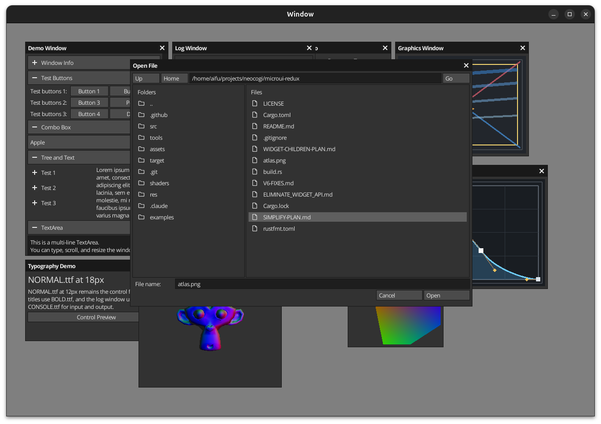

# Rxi's Microui Port to Idiomatic Rust
[](https://crates.io/crates/microui-redux)

This project started as a C2Rust conversion of Rxi's MicroUI and has since grown into a Rust-first UI toolkit. It keeps Microui's compact rendering model while moving UI authoring onto retained `WidgetTree` values, stateful widget structs, stable retained node IDs, and backend-agnostic rendering hooks.

Compared to [microui-rs](https://github.com/neocogi/microui-rs), this crate embraces std types, reusable retained trees, and richer widgets such as custom rendering callbacks, dialogs, and a file dialog.

## Demo
Clone and build the demo (enable exactly one backend feature):
```
$ cargo run --example demo-full --features example-vulkan   # Vulkan backend
# or
$ cargo run --example demo-full --features example-glow     # Glow backend
# or
$ cargo run --example demo-full --features example-wgpu     # WGPU backend
```

`example-backend` is only a shared gate for example code paths; it is **not** runnable by itself.
Running with only `--features example-backend` will fail intentionally at compile time.

`demo-full` now loads `examples/FACEPALM.png` and `assets/suzanne.obj` from disk at runtime (no `include_bytes!` for those files).

For a smaller release executable with runtime-loaded assets, build without default features and
enable exactly one backend plus `builder`:
```bash
cargo build \
  --release \
  --example demo-full \
  --no-default-features \
  --features "example-glow builder"
```

This keeps demo assets outside the executable: fonts/icons are read from `assets/`, the external
demo image is read from `examples/FACEPALM.png`, and the Suzanne mesh is read from
`assets/suzanne.obj`. To inspect real binary section size rather than asset size, use
`size -A target/release/examples/demo-full`.

If `atlas.png` has already been generated, the demo can skip runtime font/icon atlas construction
and load the atlas image from disk instead:
```bash
cargo build \
  --release \
  --example demo-full \
  --no-default-features \
  --features "example-glow external-atlas"
```

For an even smaller executable, use nightly + rebuilt `std`:
```bash
CARGO_PROFILE_RELEASE_PANIC=immediate-abort \
CARGO_TARGET_X86_64_UNKNOWN_LINUX_GNU_RUSTFLAGS="-C strip=symbols -C link-arg=-s -Zlocation-detail=none -Zfmt-debug=none" \
cargo +nightly build \
  --release \
  -Z build-std=std,panic_abort \
  -Z build-std-features=optimize_for_size \
  -Z panic-immediate-abort \
  --example demo-full \
  --no-default-features \
  --features "example-wgpu builder"
```
Replace `example-wgpu` with `example-glow` or `example-vulkan` if needed.



## Key Concepts
- **Context**: owns the high-level `Renderer`, user input, frame results, and retained root windows. Applications deliver input and mutate frame resources first, then `frame(FrameInfo)?.render_ui()?` traverses registered roots and submits one owned frame.
- **Container**: the internal execution object behind windows, popups, scroll areas, and retained tree nodes. Application code should normally work through `Context`, `ScrollAreaHandle`, and `WidgetTreeBuilder` instead of authoring widgets directly on a container. `ScrollAreaHandle` exposes retained state, focus, and scroll access; direct draw/clip/body mutation is not part of the public application API.
- **Layout engine + flows**: the engine tracks scope stack, scroll-adjusted coordinates, and content extents, while flows control placement behavior. `WidgetTreeBuilder` exposes retained row/grid/column/stack structure, and widget layout uses each widget's `measure` result so `SizePolicy::Auto` can follow per-widget intrinsic sizing.
- **Widget**: stateful UI element implementing the `Widget` trait (for example `Button`, `Textbox`, `Slider`). Retained traversal keys widget interaction by stable retained node IDs.
- **WidgetTree**: retained widget/layout hierarchy built once with `WidgetTreeBuilder` and stored in retained roots through `Context::create_window(...)`, `Context::create_dialog(...)`, or `Context::create_popup(...)`. Tree nodes cover widgets, scroll areas, headers/tree nodes, row/grid/column/stack layout groups, and custom rendering, so UI structure stays representable as retained data instead of traversal-time callbacks.
- **Rendering**: widgets record local primitives through `Painter`; `Renderer` executes the resulting `DisplayList` through one exclusively borrowed `RendererBackend::Frame`. The portable target supports drawables up to 8192x8192 and geometry up to four maximum drawable spans beyond the viewport; see the [render subsystem guide](src/render/RENDER.md#supported-coordinate-domain) for the complete coordinate contract and integration API.
- **Typography**: atlases can now bake multiple named fonts and sizes. `Style` resolves semantic roles (`body`, `small`, `title`, `heading`, `mono`) through `FontRole`, while individual text-bearing widgets can override `config.font`.

The public API is intentionally centered on `microui_redux::prelude` for applications and `microui_redux::retained` for retained tree/root concepts such as `Context`, `ScrollAreaHandle`, `WidgetTreeBuilder`, `WidgetHandle`, `NodeId`, and `Policy`. Low-level rendering lives under `microui_redux::render`, and atlas construction lives under `microui_redux::atlas::builder`. `Container`, retained cache internals, rect-packing details, and container-level manual drawing are not part of the application authoring surface.

### Rendering

Widgets record backend-neutral drawing through `Painter`; `Renderer` executes the owned `DisplayList` and submits final geometry through `RendererBackend`. The [render subsystem guide](src/render/RENDER.md) covers architecture, clipping, textures, custom callbacks, backend implementation, and compiling code examples. For the clean breaking change from the former API, see the [rendering migration guide](MIGRATION.md).

### How `SelectedBackend::Frame<'a>` works

`SelectedBackend` is not a special type supplied by microui-redux. The examples define it as an
ordinary compile-time alias for exactly one concrete renderer:

```rust
#[cfg(feature = "example-glow")]
use common::glow_renderer::GLRenderer as SelectedBackend;
#[cfg(all(not(feature = "example-glow"), feature = "example-vulkan"))]
use common::vulkan_renderer::VulkanRenderer as SelectedBackend;
#[cfg(all(
    not(feature = "example-glow"),
    not(feature = "example-vulkan"),
    feature = "example-wgpu"
))]
use common::wgpu_renderer::WgpuRenderer as SelectedBackend;

type SelectedFrame<'a> =
    <SelectedBackend as RendererBackend>::Frame<'a>;
```

`RendererBackend::Frame<'a>` is a generic associated type (GAT): each backend chooses its own
active-frame type, and that type may borrow the backend for `'a`. For example, the GL backend
selects `GlFrame<'a>`, WGPU selects `WgpuFrame<'a>`, and Vulkan selects `VulkanFrame<'a>`. The
fully qualified alias above is simply an unambiguous way to spell “the frame type associated with
the backend selected by this build.”

The relevant part of the backend contract is:

```rust
trait RendererBackend {
    type Frame<'a>: RendererFrame
    where
        Self: 'a;

    fn frame(&mut self, info: FrameInfo) -> Result<Self::Frame<'_>, FrameError>;
    // atlas and persistent-texture methods omitted
}
```

`Self: 'a` permits the concrete frame to contain a borrow of its backend. Because Cargo selects a
concrete `SelectedBackend`, the compiler monomorphizes the callback and its frame methods; this is
not a `dyn RendererBackend` or runtime backend switch. If a selected frame does not implement an
inherent extension method used by a callback, that backend selection fails at compile time.

There are two frame values and one shared frame trait in the public lifecycle:

| Type | What it represents | What ending it does |
| --- | --- | --- |
| `ContextFrame<'ctx, B>` | The application-level logical UI frame. It exclusively borrows `Context<B>` while retained UI is traversed and recorded. | `render_ui(self)` records and submits once. Dropping without submission cancels. |
| `B::Frame<'backend>` | The backend-level RAII frame. It exclusively borrows the concrete backend only while the recorded display list is executing. | Its `Drop` implementation performs backend-specific, best-effort finalization. WGPU/Vulkan submit and present there; GL flushes before the outer window runner swaps buffers. |
| `RendererFrame` | The common trait implemented by every `B::Frame<'_>`. | Defines the standard UI operations: atlas quads/triangles, flush boundaries, and external textures. |

The lifetime is created by the borrow of `&mut B` in `RendererBackend::frame`; applications do not
choose it and should not try to make it `'static`. While the returned frame exists, it owns the
backend's exclusive mutable borrow. Safe Rust therefore prevents acquiring a second frame or
retaining the frame after rendering, and the API exposes no parallel mutable backend handle. This
is the ownership guarantee that replaces a stateful `begin`/`end` protocol.

`Context`, the selected backend, its frames, and registered render callbacks stay on their owning
thread. The rendering traits intentionally have no `Send` or `Sync` requirement. Cross-thread work
should deliver owned application data before `Context::frame`; custom callbacks execute
synchronously during display-list execution.

The complete sequence is:

```text
application/resource updates
        |
Context::frame(FrameInfo)             logical ContextFrame
        |
ContextFrame::render_ui(self)         retained update, paint, DisplayList recording
        |
Renderer preflight                    validate texture/custom-render keys
        |
RendererBackend::frame(&mut backend)  acquire SelectedBackend::Frame<'_>
        |
DisplayList execution                 RendererFrame calls + typed custom callbacks
        |
drop backend frame                    finalize/submit/present as applicable; release borrow
        |
drop logical frame                    release the exclusive Context borrow
```

The renderer acquires the backend frame only after resource preflight succeeds. Normal UI
operations use the backend-neutral `RendererFrame` methods. Immediately before a custom-render
operation, the renderer closes the current UI batch and invokes the registered callback with
`&mut SelectedFrame<'_>`. Later UI commands continue after that callback, preserving painter
order. Acquisition failures are returned as `FrameError` before callbacks execute. Once a frame
exists, its `Drop` path must be non-panicking and best-effort because Rust destructors cannot
return a presentation error.

This concrete type is useful because a backend frame may expose additional inherent methods that
are deliberately absent from `RendererFrame`: a render-pass encoder, a mesh submission method, or
another backend-specific command recorder. The example backends all provide
`enqueue_colored_vertices`, so a selected-backend callback can call it directly:

```rust
let cube_renderer = ctx.register_custom_renderer({
    let angle = angle.clone();
    move |frame: &mut SelectedFrame<'_>, args: CustomRenderArgs| {
        let Some(clip) = args.content_area.intersect(&args.view) else {
            return;
        };
        let area = CustomRenderArea { rect: args.content_area, clip };
        let vertices = build_cube_vertices(args.content_area, white_uv, angle.get());

        // This is an inherent SelectedFrame method, not part of RendererFrame.
        frame.enqueue_colored_vertices(area, vertices);
    }
})?;

let cube = widget_handle(CubeWidget::new());
let tree = UiNodeBuilder::build(move |tree| {
    tree.node(NodeOptions::with_policy(Policy::fill()))
        .custom_render(&cube, cube_renderer);
});
ctx.create_window("Cube", rect(40, 40, 360, 360), tree);
```

`register_custom_renderer` accepts a callback valid for every frame borrow lifetime. In expanded
form its important bound is `for<'frame> FnMut(&mut B::Frame<'frame>, CustomRenderArgs)`. That
higher-ranked lifetime means the callback can use the active frame but cannot save it in captured
state. The returned `CustomRenderHandle<B>` is also tagged with `B`, so inserting it into a tree for
a different backend type is a compile-time error. The UI tree stores this typed registry handle,
not a backend pointer. A handle from a different context using the same backend type has the same
Rust type, but its foreign registry namespace is rejected during renderer preflight before any
backend frame is acquired.

`CustomRenderArgs` carries the geometry needed at execution time:

- `content_area` is the full screen-space rectangle allocated to the custom widget;
- `view` is the final visible rectangle after window and scroll clipping;
- `dimensions` is the validated drawable size of the active frame.

Custom callbacks receive no input and should not acquire another frame, mutate the atlas, or
finalize/present the backend frame. Update application/widget state before `Context::frame`; inside
the callback, read that state and record work on the supplied frame. Use `Painter` instead when the
drawing can be expressed with portable UI primitives.

The complete, documented [backend-frame cube example](examples/backend-frame-cube.rs) implements a
small retained `CubeWidget`. It uses `rs_math3d`'s `Vec3f`, `Quatf`, `lookat`, `perspective`, and
`project3` primitives to transform the cube, depth-sorts its faces, and submits the resulting
triangles through `SelectedFrame::enqueue_colored_vertices`. Run it with exactly one backend:

```bash
cargo run --example backend-frame-cube --features example-glow
cargo run --example backend-frame-cube --features example-vulkan
cargo run --example backend-frame-cube --features example-wgpu
```

### Retained-mode migration status

The current supported authoring path is retained widget trees registered as context-owned roots. Applications can call `Context::create_window(...)`, `Context::create_dialog(...)`, or `Context::create_popup(...)` once, mutate retained widget handle state over time, and drive frames with `Context::frame(FrameInfo).render_ui()?`.

Per-frame root submission APIs have been removed from the public surface. Root trees are registered or replaced explicitly with `create_window`, `create_dialog`, `create_popup`, and `set_root_tree`; visibility is controlled with `set_root_visible`.

```rust
let name = widget_handle(Textbox::new(""));
let mut name_node = NodeId::default();
let tree = WidgetTreeBuilder::build(|tree| {
    tree.row(&[SizePolicy::Fixed(120), SizePolicy::Remainder(0)], SizePolicy::Auto, |tree| {
        tree.text("Name");
        name_node = tree.widget(&name);
    });
});

let root = ctx.create_window("main", rect(20, 20, 240, 120), tree);
let info = FrameInfo::try_new(Dimensioni::new(800, 600), color(20, 22, 26, 255))?;
ctx.frame(info).render_ui()?;

if ctx.committed_results().state_of_retained(RetainedId::root_node(root, name_node)).is_submitted() {
    // react to the textbox submission here
}
```

Retained trees are the supported public authoring path. Post-render business logic reads from `ctx.committed_results()`, which intentionally exposes the previous frame's published interaction generation:

```rust
let info = FrameInfo::try_new(Dimensioni::new(800, 600), color(20, 22, 26, 255))?;
ctx.frame(info).render_ui()?;

let results = ctx.committed_results();
if results.state_of_retained(RetainedId::root_node(root, submit_button_node)).is_submitted() {
    save_form();
}
```

### Retained Node IDs
Retained-tree focus and hover use the stable `NodeId` assigned by `WidgetTreeBuilder`, scoped by the owning root or scroll area, so keyed retained nodes keep interaction continuity even when the backing widget handle changes. `ctx.committed_results().state_of_node(node_id)` exposes the same stable lookup for retained nodes when the node ID is unambiguous; `state_of_retained(RetainedId::root_node(root_id, node_id))` accepts the richer retained key.

For retained focus, keep the `NodeId` returned by `WidgetTreeBuilder` and use `set_focus_node`:

```rust
my_window.set_focus_node(textbox_node_id);
```

Registered roots can be configured with `Context::set_root_options(...)` to control chrome/container options. Root overflow does not scroll implicitly; wrap overflowing retained content in `WidgetTreeBuilder::scroll_area(...)`. Custom widgets can still use widget-level `ScrollBehavior` and receive consumed scroll through `WidgetCtx` during their update phase.

### Preferred sizing and retained layout
- Every built-in widget reports its own intrinsic preferred size from content metrics (text/icon/thumb/line layout).
- Retained traversal measures committed widget state, allocates widget rectangles, updates the whole retained tree with `Widget::update`, then paints the whole retained tree with `Widget::paint`.
- Internally, `NodeBehavior` is the runtime contract shared by widget adapters and framework containers. `WidgetNode` adapts the public `Widget` trait to it; application widgets never receive the internal node update/input/paint contexts.
- Parent containers assign each node a retained parent-local allocation; child offsets and clips remain node-local and are resolved through a stack-only transform during traversal.
- Resolved outer rectangles and clips remain runtime stack locals. Node behavior works against its local content surface, while outer frame painting, standard hit routing, and conversion from screen input remain runtime-owned.
- A public widget's Painter geometry and routed pointer positions share the derived content-local origin.
- `WidgetTreeBuilder` exposes retained `row`, `grid`, `column`, `stack`, `header`, `tree_node`, `scroll_area`, and `custom_render` structure so layout stays declarative instead of closure-driven.
- `SizePolicy::Weight(value)` distributes available track space by sibling share ratio (spacing accounted for). Use `SizePolicy::Fraction(value)` for explicit `0.0..=1.0` proportional sizing in single-track flows.
- Returning `<= 0` for either axis from `Widget::measure` still means "use layout fallback/defaults" for that axis.

Built-in widget structs keep their fields public as retained state so application code can update labels, values, fonts, and options between frames. Raw input is not exposed through `Context`; feed events through methods such as `mousemove`, `mousedown`, `scroll`, `keydown_code`, and `text`. Widgets clamp their own transient invariants, such as UTF-8 cursor positions, scroll offsets, selected indices, and slider bounds, during `Widget::update`.

## Fonts and typography
- Atlas building supports multiple baked fonts and sizes through `atlas::builder::FontAsset`, and the same config can drive both runtime atlas construction and offline/prebuilt atlas export.
- `Context::new(...)` binds the conventional atlas keys `body`, `small`, `title`, `heading`, and `mono` onto the default `Style`. `Context::set_style(...)` also rebinds any font fields that are still left at their default/unset values, so tweaking colors or spacing on top of `Style::default()` keeps the intended body/title sizes.
- Text-bearing widgets expose `config.font: FontChoice`, so you can either select a semantic role (`FontRole::Heading.into()`) or a concrete baked font ID (`atlas.font_id("caption").unwrap().into()`).
- Font sizes are selected by choosing another baked font variant, not by scaling one bitmap font at runtime.
- `examples/demo-full` uses this directly: `NORMAL.ttf` for control/body text, `BOLD.ttf` for window titles, and `CONSOLE.ttf` for the log window’s input/output text.

```rust
use microui_redux::{atlas::builder, prelude::*};

const FONTS: &[builder::FontAsset<'static>] = &[
    builder::FontAsset {
        name: "body",
        path: "assets/NORMAL.ttf",
        size: 12,
    },
    builder::FontAsset {
        name: "small",
        path: "assets/NORMAL.ttf",
        size: 10,
    },
    builder::FontAsset {
        name: "title",
        path: "assets/BOLD.ttf",
        size: 16,
    },
    builder::FontAsset {
        name: "heading",
        path: "assets/NORMAL.ttf",
        size: 18,
    },
    builder::FontAsset {
        name: "mono",
        path: "assets/CONSOLE.ttf",
        size: 12,
    },
];

let config = builder::Config {
    texture_width: 512,
    texture_height: 256,
    white_icon: "assets/WHITE.png".into(),
    close_icon: "assets/CLOSE.png".into(),
    expand_icon: "assets/PLUS.png".into(),
    collapse_icon: "assets/MINUS.png".into(),
    check_icon: "assets/CHECK.png".into(),
    expand_down_icon: "assets/EXPAND_DOWN.png".into(),
    open_folder_16_icon: "assets/OPEN_FOLDER_16.png".into(),
    closed_folder_16_icon: "assets/CLOSED_FOLDER_16.png".into(),
    file_16_icon: "assets/FILE_16.png".into(),
    default_font: "assets/NORMAL.ttf".into(),
    default_font_size: 12,
    fonts: FONTS,
};

let mut title = TextBlock::new("Inspector");
title.config.font = FontRole::Heading.into();
```

If `fonts` is empty, `builder::Config` falls back to `default_font` + `default_font_size` for the old single-font atlas layout.

## Cargo features
- `builder` *(default)* – enables the runtime atlas builder and PNG decoding helpers used by the examples.
- `png_source` – allows serialized atlases and `ImageSource::Png { .. }` uploads to stay compressed.
- `save-to-rust` – enables `AtlasHandle::to_rust_files` to emit the current atlas as Rust code for embedding.
- `prebuilt-atlas` – opt-in example atlas embedding; without it, examples build their atlas at runtime.
- `example-backend` – shared internal gate used by examples; pair it with exactly one concrete backend.
- `example-glow` / `example-vulkan` / `example-wgpu` – concrete example backends; choose exactly one when running examples.

Disabling default features leaves only the raw RGBA upload path (`ImageSource::Raw { .. }`):
`cargo build --no-default-features`

The demos build their atlas at runtime unless you opt into `prebuilt-atlas`, so `--no-default-features` example builds should include `builder`:
`cargo run --example demo-full --no-default-features --features "example-vulkan builder"`

Equivalent command using the shared gate explicitly:
`cargo run --example demo-full --no-default-features --features "example-backend example-vulkan builder"`

To embed the generated atlas instead, add `prebuilt-atlas` explicitly:
`cargo run --example demo-full --no-default-features --features "example-vulkan prebuilt-atlas"`

To export an atlas as Rust, enable `save-to-rust` (and `png_source` when serializing PNG-backed atlas data) and call `AtlasHandle::to_rust_files`. The helper binary requires `builder`, `save-to-rust`, and `png_source`:
`cargo run --bin atlas_export --features "builder save-to-rust png_source" -- --output path/to/atlas.rs`

### Version 0.7.0
Version `0.7.0` is the context-owned retained-root release. Compared to `0.6.1`, it completes the retained migration by moving root lifetime, interaction identity, and frame traversal into the context instead of requiring applications to resubmit each root every frame.

- [x] Moved retained root lifetime into `Context`.
    - [x] Applications register windows, dialogs, and popups with `create_window`, `create_dialog`, and `create_popup`.
    - [x] Registered roots are traversed by `ContextFrame::render_ui`; visibility, replacement, and options are controlled with `set_root_visible`, `set_root_tree`, and `set_root_options`.
    - [x] The old callback-based per-frame root submission path was removed from the supported API.
- [x] Replaced pointer-derived public interaction lookup with stable retained identity.
    - [x] `WidgetTreeBuilder` returns stable `NodeId`s for result lookup and focus control.
    - [x] `FrameResultGeneration::state_of_retained` and `state_of_node` supersede handle/address-based result lookup.
    - [x] Root windows, scroll areas, and window chrome derive scoped retained IDs so focus, hover, resize, and close interactions survive tree replacement.
- [x] Split retained widget execution into explicit `measure`, `update`, and `paint` phases.
    - [x] Layout records geometry first; update records control state and frame results; paint records commands from updated widget state.
    - [x] Custom-render nodes receive content and clip geometry through `CustomRenderArgs`, while widget input remains in the update phase.
    - [x] Built-in widgets, file dialog UI, and examples now follow the same committed-results path.
- [x] Reworked retained layout, scroll areas, and root chrome.
    - [x] `SizePolicy::Weight` now uses sibling share ratios, and `SizePolicy::Fraction` covers explicit proportional sizing.
    - [x] `ScrollAreaHandle` is the retained nested-scroll API; old panel/container compatibility names were removed.
    - [x] Root auto-size, popup placement/close behavior, dialog z-order, scrollbars, and bottom-right resize handling were aligned with retained traversal.
- [x] Tightened drawing, texture, atlas, and backend behavior.
    - [x] Renderer display-list execution batches ordinary draw operations while preserving custom render and retained scroll-area boundaries.
    - [x] External texture uploads validate dimensions and byte counts, and texture clipping has a dedicated smoke example.
    - [x] Atlas code is split into builder, runtime, image, source, and codegen modules; `atlas_export` now requires `png_source` when exporting PNG-backed atlas data.
    - [x] Glow, Vulkan, and WGPU examples share retained root handling, and `examples/retained-custom-drawing` documents the custom painting path.
- [x] Unified rendering behind `Painter`, `DisplayList`, `Renderer`, and `RendererBackend`.
    - [x] Removed the old immediate drawing and mutable clipping facades in favor of scoped recording and single-pass execution.
    - [x] Removed the shared backend handle; Renderer now uniquely owns its backend and lends one typed frame to synchronous execution.
    - [x] Added a complete [rendering migration guide](MIGRATION.md) for the clean break.
- [x] Reduced migration surface and documented internals.
    - [x] Public imports are grouped around `prelude`, `retained`, and the `render` subsystem.
    - [x] Direct container drawing is no longer part of the application authoring path.
    - [x] Runtime modules, private structs, enums, and functions now have rustdoc or implementation comments, and the retained behavior is covered by focused tests.

### Version 0.6.x
Version `0.6.0` introduced retained `WidgetTree` authoring on top of the older per-frame root submission loop. Compared to `0.5.0`, `0.6.x` replaced immediate/closure widget authoring with reusable retained trees, widget handles, committed interaction results, custom graphics primitives, and multi-font atlas support.

- [x] `Context::window`, `Context::dialog`, and `Context::popup` accepted retained trees instead of UI-building closures.
- [x] `WidgetTreeBuilder` introduced reusable widget/layout hierarchies with widgets, panels, headers/tree nodes, row/grid/column/stack groups, and custom-render leaves.
- [x] Widgets reported intrinsic sizes through `measure` and updated persistent state through the retained traversal.
- [x] `Context::committed_results()` became the public business-logic view of the previous frame's interaction results.
- [x] `WidgetCtx` gained widget-local custom painting for rectangles, text/icons/images, line strokes, polygon fills, and scoped clips.
- [x] Runtime atlas building and offline/prebuilt atlas export gained shared multi-font configuration.
- [x] Version `0.6.1` switched demos to runtime atlas construction by default and made prebuilt atlas embedding opt-in.

### Version 0.5
- [x] Widget identity moved fully to pointer-based IDs.
    - [x] Removed `with_id`; focus/hover now use widget trait-object/state pointers.
- [x] Layout refactor: introduced `LayoutEngine` + specialized flows (`RowFlow`, `StackFlow`) instead of a one-size-fits-all manager.
    - [x] Preferred sizing pipeline: widget helpers now call `Widget::measure`, allocate rectangles, then run widgets directly against the current frame input.
    - [x] Directional stack support: `StackDirection::{TopToBottom, BottomToTop}` plus `stack_direction` and `stack_with_width_direction`.
- [x] Context/container API cleanup: `Context` module split, input forwarding helpers, container state encapsulation, and handle views.
- [x] Widget internals cleanup: helper macroization/simplification, node/widget scaffolding unification, and text widget module split.
- [x] Text and input fixes: shared text layout/edit paths, textbox delete/end fixes, centralized widget input fallback.
- [x] Scrollbar behavior cleanup: unified sizing, layout, and drag handling.
- [x] File dialog and atlas fixes, including file dialog layout redesign and footer/button spacing corrections.
- [x] Added WGPU example backend and migrated demo-full to new layout flow APIs.
- [x] Added directional stack demo window and expanded documentation/comments for layout and WGPU renderer.

### Version 0.4
- [x] Stateful widgets
    - [x] Stateful widgets for core controls (button, list item, checkbox, textbox, slider, number, custom).
    - [x] Pointer-based widget IDs; InputSnapshot threaded through widgets and cached per frame.
    - [x] IdManager removed; widget IDs now derive from state pointers.
    - [x] Widget API redesign requires stateful widget instances; trait/type renames applied.
    - [x] Legacy `button_ex*` shims removed.
    - [x] Drawing state was extracted into the shared widget execution context.
    - [x] WidgetState/WidgetCtx pipeline with ControlState returned from `update_control`.
- [x] File dialog UX fixes (close on OK/cancel, path-aware browsing).
- [x] Expanded unit tests for scrollbars, sliders, and PNG decoding paths.
- [x] Style shared via `Rc<Style>` across containers/panels; window chrome state moved into `Window`.
- [x] `Container::style` now uses `Rc<Style>`.

### Version 0.3
- [x] Use `std` (`Vec`, `parse`, ...)
- [x] Containers contain clip stack and command list
- [x] Move `begin_*`, `end_*` functions to closures
- [x] Move to AtlasRenderer Trait
- [x] Remove/Refactor `Pool`
- [x] Change layout code
- [x] Treenode as tree
- [x] Manage windows lifetime & ownership outside of context (use root windows)
- [x] Manage containers lifetime & ownership outside of contaienrs
- [x] Software based textured rectangle clipping
- [x] Add Atlasser to the code
    - [x] Runtime atlasser
        - [x] Icon
        - [x] Font (Hash Table)
    - [x] Separate Atlas Builder from the Atlas
    - [x] Builder feature
    - [x] Save Atlas to rust
    - [x] Atlas loader from const rust
- [x] Image widget
- [x] Png Atlas source
- [x] Pass-Through rendering command (for 3D viewports)
- [x] Custom Rendering widget
    - [x] Mouse input event
    - [x] Keyboard event
    - [x] Text event
    - [x] Drag outside of the region
    - [x] Rendering
- [x] Dialog support
- [x] File dialog
- [x] API/Examples loop/iterations
    - [x] Simple example
    - [x] Full api use example (3d/dialog/..)
- [x] Documentation
